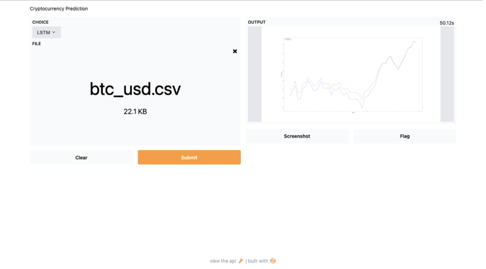

# CryptoTracer
Cryptocurrency is an alternative medium of exchange consisting of numerous decentralized crypto coin types. Since its inception in 2009, Bitcoin has become a digital commodity of interest as some believe the crypto coins’ worth is comparable to that of traditional fiat currency. Our method for determining the price prediction of whether the price will go up or down based on the sentiments of users involves correlating prices with one of today’s most popular social media sources, Twitter. The advantages of using Twitter include having access to some of the earliest and fastest news updates in a concise format as well as being able to extract data from this social media platform with relative ease. Our model strategy applies Deep Learning algorithms including Long Short Term Network (LSTM), Gated Recurrent Unit (GRU), and Recurrent Neural Network (RNN) to determine whether the price of BTC (digital currency) will increase or decrease within a predetermined time interval and will also show the sentiment of the tweet entered by a user. The two approaches for training the model involve using direct text, like tweets from Twitter users, and using third-party open-source sentiment analysis APIs to rate the positivity and negativity of words within each post.

## Here is our index page :

## The various features included in our web application are :
### 
*Realtime Screener:*
The real-time screener gives real-time cryptocurrency prices in 3-minute intervals. We have used Coinbase API to generate the graph data as well as the list of cryptocurrencies as shown. The data was then rendered into a graph widget. The user can see live data of the prices of the cryptocurrency of their choice. 
 
## For Bitcoin

## For Etherium

## Top Trending Cryptocurrencies
This API generates all the top trending cryptocurrencies from yahoo finance and the data was then rendered into a table widget. The user can see the Change, percent Change, Market Cap, Volume in Currency, Total Volume All Currencies (24Hr), and Circulating Supply

Furthermore, on selecting any one of the cryptocurrencies, the user will be led to another page that gives a general overview of that cryptocurrency. Here, we have utilized the API of TradingView to render an interactive graph as shown in the image below.

## News Scraper
We web scrapped from popular Indian news sites and pick up news only related to Live cryptocurrency markets and displayed news related to keywords like 'cryptocurrency',    'crypto',   'bitcoin', 'crash', 'cryptocurrency prices',  'crash',  'market' to name a few.
 We used beautiful soup for this purpose. The news gets updated in real-time and has been sourced from Economic Times, TOI. 

## Prediction Model
Gradio is an open-source library where we can quickly create customizable UI components around our TensorFlow or PyTorch models or even arbitrary Python functions. Mix and match components to support any combination of inputs and outputs.
Ours was embedded in Python notebooks and presented on a webpage. It automatically generates a public link we can share with colleagues that let users interact with the model from their computer remotely from their own devices.
Users can upload a dataset of any cryptocurrency of their liking and generate a graph depending on which model they'd like to implement

